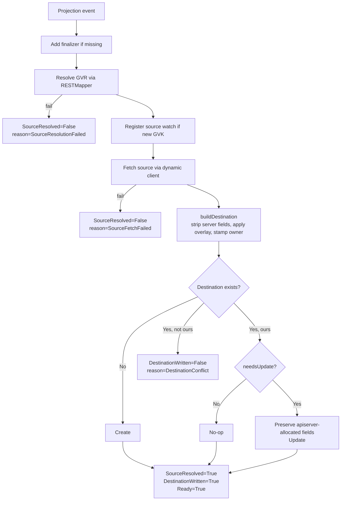

# Concepts

A `Projection` (or its cluster-scoped sibling, `ClusterProjection`) is a declarative instruction: *take this source object, produce a copy at this destination, keep it in sync*. This page explains the moving pieces.

`projection.sh/v1` ships two CRDs that share most of their shape and differ only in *where* the destination lives:

| CRD                 | Scope       | Destinations                                                                |
| ------------------- | ----------- | --------------------------------------------------------------------------- |
| `Projection`        | Namespaced  | Single target — the Projection's own `metadata.namespace`.                  |
| `ClusterProjection` | Cluster     | Fan-out — an explicit list of namespaces, or every namespace matching a selector. |

Both CRDs share the same `source`, `overlay`, ownership, and reconcile model; the only meaningful difference is destination shape. Most of the rest of this page applies to both unless called out.

## 1. Source

The source uniquely identifies the Kubernetes object to mirror:

```yaml
spec:
  source:
    kind: ConfigMap         # required, PascalCase
    namespace: platform     # required, DNS-1123
    name: app-config        # required, DNS-1123
    # group and version are optional — see SourceRef fields below
```

The five SourceRef fields:

- `group` — API group of the source object. Optional; empty means the core group (`ConfigMap`, `Secret`, `Service`, ...).
- `version` — API version of the source object within its group. Optional; empty means the operator resolves the preferred served version via the RESTMapper on every reconcile. Set explicitly to pin.
- `kind` — API Kind, PascalCase. Required.
- `namespace` — Source namespace. Required.
- `name` — Source object name. Required.

`group`, `version`, and `kind` together identify a `GroupVersionKind`. All five fields are pattern-validated at admission time — typos fail at `kubectl apply`, not at runtime. The combination is resolved through the apiserver's `RESTMapper`, so anything the cluster knows about works: built-ins, aggregated APIs, CRDs.

`projection` only mirrors **namespaced resources**. Pointing the source at a cluster-scoped Kind (`Namespace`, `ClusterRole`, `StorageClass`, `CustomResourceDefinition`, `PriorityClass`, …) is rejected at reconcile time with `SourceResolved=False reason=SourceResolutionFailed` and a message identifying the Kind as cluster-scoped. There can only be one `Namespace` named `foo` in a cluster, so mirroring it has no meaning; the rejection prevents a malformed dynamic-client URL from surfacing as a confusing 404.

### Pinned vs. preferred version

`version` is optional for any group, including core. Four forms are supported:

| Form                                        | Semantics                                                                          |
| ------------------------------------------- | ---------------------------------------------------------------------------------- |
| `kind: ConfigMap` (group + version omitted) | Core group, RESTMapper-preferred served version (`v1` today).                      |
| `group: ""`, `version: v1`                  | Core group, pinned to v1.                                                          |
| `group: apps`, `version: v1`                | Named group, pinned to v1.                                                         |
| `group: apps` (`version` omitted)           | Named group, RESTMapper-preferred served version.                                  |

**Pinned** is an explicit stability anchor: useful when you're mid-migration and want to lock the projection to a specific version while you validate behavior, or when you intentionally need to fall behind a CRD upgrade.

**Preferred** (no `version`) follows the cluster: when a CRD author promotes `v1beta1` → `v1` and stops serving `v1beta1`, projection picks up the new preferred version on the next reconcile rather than failing with `SourceResolutionFailed` and garbage-collecting your destinations. The same form works for any group — core, `apps`, `networking.k8s.io`, `example.com`. For core sources the preferred version is always `v1`, so the resolved GVR is stable in practice.

The resolved version is reported in the `SourceResolved` condition message (`kubectl describe projection`), so you can always answer "which version is this currently on?" without operator log access.

## 2. Destination

The destination says where to write the copy. The shape depends on which CRD you're using.

### Namespaced `Projection`

A `Projection` always writes a **single destination** in its own namespace:

```yaml
apiVersion: projection.sh/v1
kind: Projection
metadata:
  name: shared-config
  namespace: tenant-a       # ← destination namespace = this
spec:
  source:
    group: ""
    version: v1
    kind: ConfigMap
    namespace: platform
    name: app-config
  destination:
    name: shared-config     # optional rename; defaults to source.name
```

The destination namespace is **always** the Projection's own `metadata.namespace`. There is no `spec.destination.namespace` field — write a Projection in the namespace that should receive the copy. `spec.destination.name` is optional and only exists to rename the destination (defaults to `source.name` when omitted).

This is the most common shape. A namespace-scoped CRD is the natural unit for delegating mirroring authority: granting `edit` on `Projection` in a namespace lets a tenant pull approved sources into their namespace without giving them write access to anything else.

### `ClusterProjection`

A `ClusterProjection` is cluster-scoped and **fan-out only**. It writes the same destination object into multiple namespaces. There are two ways to specify the target set:

#### Explicit list

```yaml
apiVersion: projection.sh/v1
kind: ClusterProjection
metadata:
  name: shared-config-fanout
spec:
  source:
    group: ""
    version: v1
    kind: ConfigMap
    namespace: platform
    name: app-config
  destination:
    namespaces: [tenant-a, tenant-b, tenant-c]   # listType=set; minItems=1
    name: shared-config                           # optional rename
```

`namespaces` is a set of namespace names (CRD `+listType=set`, `minItems=1`). Each entry gets one destination, independently created/updated. Removing an entry on a subsequent edit deletes the destination from that namespace.

The list form is **small, stable, reviewable in YAML**. Pull-request diffs show exactly which namespaces are in scope. Use this when the target set rarely changes and a human approves additions.

#### Selector-based

```yaml
apiVersion: projection.sh/v1
kind: ClusterProjection
metadata:
  name: shared-config-fanout
spec:
  source:
    group: ""
    version: v1
    kind: ConfigMap
    namespace: platform
    name: app-config
  destination:
    namespaceSelector:
      matchLabels:
        projection.sh/mirror: "true"
    name: shared-config
```

Every namespace matching the selector gets a destination. The selector form is **auto-growing**: a new namespace created with the matching label is picked up by the next reconcile and the destination appears within the round-trip latency of the namespace watch.

The selector form is the right choice when namespace creation is itself automated — onboarding flows that label new tenant namespaces, GitOps-managed namespace inventories, or label-driven environment topologies.

#### Mutex

`namespaces` and `namespaceSelector` are mutually exclusive *and* one of them must be set. CEL admission enforces both rules:

- `!(has(self.namespaces) && has(self.namespaceSelector))` — at most one
- `has(self.namespaces) || has(self.namespaceSelector)` — at least one

`spec.destination.name` (rename override) is optional under both forms; it defaults to `source.name`.

#### Fan-out behavior

- Each target namespace gets a destination, independently created/updated. The same source becomes one destination per namespace.
- For selectors: if a namespace later stops matching (label removed), its destination is deleted. For lists: removing a namespace from `namespaces` deletes that destination on the next reconcile.
- For selectors: creating a new namespace with the matching label triggers a reconcile and the destination appears.
- A conflict in one namespace (stranger object at the destination) doesn't block the others; `DestinationWritten` is a rollup condition with per-namespace detail surfaced via Events. `status.namespacesWritten` and `status.namespacesFailed` track the counts.
- On ClusterProjection deletion, all owned destinations are cleaned up across every namespace.

The destination `Kind` is always the same as the source `Kind` — `projection` does not transform Kinds.

## 3. Overlay

The overlay merges **labels** and **annotations** on top of the source's metadata before writing:

```yaml
spec:
  overlay:
    labels:
      tenant: tenant-a
      projected-by: projection
    annotations:
      mirror.example.com/source: platform/feature-flags
```

Merge rules:

- Source labels/annotations are preserved.
- Overlay entries **win on conflict** (overlay-last semantics — overlay is applied after the source, so its values overwrite source values for any shared key).
- `spec` / `data` are never modified by the overlay — it only touches metadata.

Regardless of what you put in overlay, the controller always stamps an ownership annotation and label (next section). Attempting to set ownership keys via overlay is a no-op — they are overwritten on every reconcile.

## 4. Ownership

Every destination written by a Projection or ClusterProjection is stamped with two ownership markers — an annotation and a label. **The annotation is the authoritative ownership signal.** The label is a watch hint and is never trusted alone for access decisions.

### Keys

| CRD                | Annotation                                                                | Label                                                            |
| ------------------ | ------------------------------------------------------------------------- | ---------------------------------------------------------------- |
| `Projection`       | `projection.sh/owned-by-projection: <projection-ns>/<projection-name>`    | `projection.sh/owned-by-projection-uid: <projection-uid>`        |
| `ClusterProjection`| `projection.sh/owned-by-cluster-projection: <projection-name>`            | `projection.sh/owned-by-cluster-projection-uid: <projection-uid>`|

The cluster annotation has no `<ns>/` prefix because `ClusterProjection` is cluster-scoped — its name alone is the cluster-wide identifier.

### Discipline: annotation is authoritative, label is a hint

Every write and every delete checks the annotation. The exact match against `<ns>/<name>` (or `<name>` for ClusterProjection) is what proves a destination was written by *this* Projection and not somebody else's. The annotation is the only ownership signal the reconciler ever trusts.

The UID label exists for one reason: it's the indexed key for label-selector watches. `ensureDestWatch` (see [Watches](#7-watches)) registers a destination-side watch filtered on the UID label so that a manual `kubectl delete` of a destination triggers an immediate reconcile rather than waiting for the next requeue. The label is also used by cleanup paths (stale-destination cleanup, finalizer sweep) to find owned destinations via a single cluster-wide `List(LabelSelector)` instead of walking every namespace.

After the label-driven list, every candidate's annotation is verified again before any write or delete. A malicious actor or accidental copy could put the UID label on a stranger's object — and the controller would still refuse to touch it, because the annotation wouldn't match.

### Outcomes

On every reconcile, before touching an existing destination, the controller checks the annotation. The three outcomes:

| Destination state                                  | Behavior                                                        |
| -------------------------------------------------- | --------------------------------------------------------------- |
| Does not exist                                     | Create it, stamp the ownership annotation and UID label.        |
| Exists with matching ownership annotation          | Update it (only if `needsUpdate` says the content differs).     |
| Exists with a different or missing annotation      | Refuse; report `Ready=False reason=DestinationConflict`.        |

This is what prevents `projection` from silently clobbering an object somebody else created by mistake or on purpose.

## 5. Finalizer

When a Projection is first reconciled, the controller adds a finalizer:

| CRD                | Finalizer name                       |
| ------------------ | ------------------------------------ |
| `Projection`       | `projection.sh/finalizer`            |
| `ClusterProjection`| `projection.sh/cluster-finalizer`    |

On deletion:

1. The finalizer blocks final removal.
2. The controller looks up the destination(s) — for ClusterProjection, it sweeps every owned destination across the cluster via the UID label.
3. For each destination that still carries our ownership annotation, delete it.
4. If the annotation has been stripped or changed, **leave the destination alone** and emit a `DestinationLeftAlone` event.
5. Remove the finalizer.

Stripping the ownership annotation is therefore a deliberate escape hatch: "this mirror has become authoritative, don't touch it."

## 6. Reconcile lifecycle



Each step in plain prose:

1. **Resolve GVR.** Combine `spec.source.{group, version, kind}` and run it through the `RESTMapper`. If `version` is omitted, look up the preferred served version. If the cluster doesn't know the Kind, fail with `SourceResolutionFailed`.
2. **Register source watch.** On the first time we see a given GVK, register a metadata-only watch against the cache so future edits to *any* source of that Kind are fanned out to the referencing Projections via a field-indexed lookup.
3. **Fetch the source** via the dynamic client using the resolved GVR.
4. **Build the destination object.** Deep-copy the source, strip server-owned metadata (`resourceVersion`, `uid`, `managedFields`, `ownerReferences`, etc.), drop `.status`, remove `kubectl.kubernetes.io/last-applied-configuration`, strip Kind-specific apiserver-allocated spec fields (`Service.spec.{clusterIP, clusterIPs, ipFamilies, ipFamilyPolicy}`, `PersistentVolumeClaim.spec.volumeName`, `Pod.spec.nodeName`, `Job.spec.selector` plus the auto-generated `controller-uid` / `batch.kubernetes.io/controller-uid` / `batch.kubernetes.io/job-name` labels on `spec.template.metadata.labels`), apply the overlay, stamp the ownership annotation and UID label, set destination namespace and name. Jobs created with `spec.manualSelector: true` are a known limitation — the controller's stripping logic assumes the apiserver-managed selector path.
5. **Conflict check.** If an object already exists at the destination and isn't ours, fail with `DestinationConflict` — do not write.
6. **Create or update.** On update, preserve apiserver-allocated fields the apiserver re-assigned (so an `Update` isn't rejected for clearing an immutable field), and **diff** against the existing destination. If nothing changed, skip the write entirely (prevents noisy Events / metric churn on steady-state reconciles).
7. **Update status.** Flip `SourceResolved`, `DestinationWritten`, and `Ready` to `True` in a single status write. Populate `status.destinationName` with the resolved name. For ClusterProjection, increment `status.namespacesWritten`. Increment `projection_reconcile_total{result="success"}`.

On any failure the corresponding condition flips to `False` (or `Unknown` for writes that never happened because the source side failed), a `Warning` event fires, and the metric increments with the right `result` label. The periodic `RequeueAfter` on the error path is a safety net (default 30 s, tunable via the `--requeue-interval` flag or the Helm `requeueInterval` value); the dynamic source watch is authoritative for the happy path.

**Source deletion** is a distinct signal. If the source `Get` returns 404 (the source was deleted, not a transient connectivity/RBAC failure), the controller cleans up every destination owned by this Projection — single or fan-out — and surfaces `SourceResolved=False reason=SourceDeleted` with a single `Warning SourceDeleted` event. Recreating the source triggers a fresh reconcile that re-projects. Other source-fetch errors (transient connectivity, RBAC blips, 5xx) keep `SourceFetchFailed` semantics and leave destinations in place.

## 7. Watches

`projection` uses three classes of watch — one declared at startup, two registered lazily during reconcile.

### Declared at startup

- A watch on `Projection` and `ClusterProjection` themselves.
- A watch on `Namespace`, so selector-based ClusterProjections re-reconcile when the matching set changes.

### Source watches (lazy, per-GVK)

The first reconcile for a given source GVK registers a dynamic, **metadata-only** source watch — we don't need the full object, events just enqueue Projections, the next reconcile fetches fresh.

A field indexer on `spec.sourceKey` maps source events back to every Projection referencing that source. The key is derived from `group/kind/namespace/name` — **`version` is deliberately excluded**. Two Projections that pin different versions of the same logical source share the same `sourceKey` and the same watch; an edit to the source enqueues both. Dropping the version from the key avoids registering N near-duplicate watches for the same underlying object.

A second field indexer on `spec.hasNamespaceSelector` lets `Namespace` events efficiently re-enqueue only the selector-based ClusterProjections, not every Projection in the cluster.

Subsequent Projections that reference the same GVK reuse the existing source watch. The active watch count is exposed as the `projection_watched_gvks` Prometheus gauge.

### Destination watches (lazy, per-GVK)

`ensureDestWatch` registers a destination-side watch for each destination GVK encountered during reconcile, filtered on the UID-label selector for that Projection. This is what makes manual deletion of a destination trigger an immediate reconcile — `kubectl delete configmap -n tenant-a app-config` and the destination is recreated within the round-trip of the watch event, not on the next periodic requeue. The label filter keeps the watch cheap: it only fires for objects that already carry an ownership UID label.

Destination watches are how the controller self-heals from human edits without polling.

### Concurrency cap

For ClusterProjection fan-out, destination writes are issued in parallel with a concurrency cap of **16**. HTTP/2 multiplexing in client-go shares a single connection across the workers; the cap exists so a ClusterProjection matching thousands of namespaces can't DoS the apiserver or blow out controller memory with goroutines.

This is what keeps propagation under ~100 ms without periodic polling.

## 8. Events

Every reconcile outcome is recorded as a Kubernetes Event on the Projection. The controller writes Events through `events.k8s.io/v1`, not the legacy `core/v1` — `kubectl get events` (the default `core/v1` view) won't show them. Query them via the `events.k8s.io` resource:

```bash
kubectl -n <projection-ns> get events.events.k8s.io \
  --field-selector regarding.name=<projection-name>,regarding.kind=Projection \
  --sort-by=.metadata.creationTimestamp
```

For ClusterProjection, set `regarding.kind=ClusterProjection` and drop the namespace flag (Events for cluster-scoped objects land in the operator's namespace by default; check `--all-namespaces` if you don't see them).

Each Event carries:

- **`reason`** — categorical outcome (`Projected`, `Updated`, `DestinationConflict`, `SourceDeleted`, `SourceOptedOut`, …). The full vocabulary is in [Observability](observability.md#reasons-youll-see).
- **`action`** — UpperCamelCase verb describing what the controller did: `Create`, `Update`, `Delete`, `Get`, `Validate`, `Resolve`, `Write`. Visible with `-o wide` or `-o yaml`.
- **`type`** — `Normal` for successful state transitions (`Projected`, `Updated`, `DestinationDeleted`, `StaleDestinationDeleted`, `DestinationLeftAlone`); `Warning` for failures.

## 9. Source projectability policy

Because the operator holds cluster-wide read RBAC, anyone authorized to create a Projection or ClusterProjection could, in principle, read any resource in the cluster via the controller. The source-projectability policy is the user-facing defense against that — source owners get to declare whether their object is eligible for projection.

**Controller-level mode** — a single cluster-admin-configured flag:

| Mode | Behavior |
|---|---|
| `allowlist` (default) | Source must carry `projection.sh/projectable: "true"`. Missing or other values are treated as not projectable. |
| `permissive` | Any source is projectable *unless* it carries the veto annotation. |

Set via the CLI flag `--source-mode=permissive|allowlist` (or the Helm value `sourceMode`).

**Source-owner veto** — always honored regardless of mode:

```yaml
metadata:
  annotations:
    projection.sh/projectable: "false"    # hard stop
```

When a previously-projected source flips to `"false"`, the destination is **garbage-collected on the next reconcile** — owners retract, not just block future copies.

**Status reasons** to recognize:

- `SourceResolved=False reason=SourceOptedOut` — source explicitly vetoed with `"false"`.
- `SourceResolved=False reason=SourceNotProjectable` — allowlist mode, no `"true"` annotation present.

**Honest limitation**: this is a *policy* control, not a true isolation boundary. The controller still has cluster-wide read RBAC, so a compromised operator pod (or a malicious Projection created by a privileged user who can bypass admission policy) is not constrained by the annotation. True end-to-end enforcement would require dynamically narrowing the controller's RBAC per declared source Kind — not yet implemented. The Helm chart's `supportedKinds` value is the closest available defense: it lets cluster admins narrow the controller's `ClusterRole` to an explicit Kind allowlist at install time (see [Security](security.md)).

## Related

- [API reference](api-reference.md) — exact field types and validation, generated from `api/v1/projection_types.go` and `api/v1/clusterprojection_types.go`.
- [CRD behavior and examples](crd-reference.md) — cross-field invariants, condition reasons, YAML examples.
- [Observability](observability.md) — conditions, events, metrics.
- [Security](security.md) — the RBAC trade-offs behind "any Kind".
