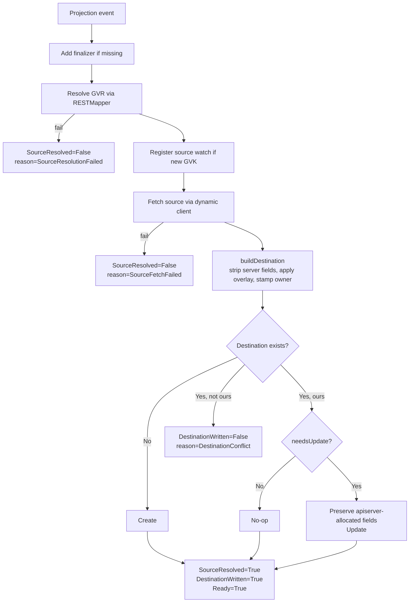

# Concepts

A `Projection` is a declarative instruction: *take this source object, produce a copy at this destination, keep it in sync*. This page explains the moving pieces.

## 1. Source

The source uniquely identifies the Kubernetes object to mirror:

```yaml
spec:
  source:
    apiVersion: v1          # required
    kind: ConfigMap         # required, PascalCase
    name: app-config        # required, DNS-1123
    namespace: platform     # required, DNS-1123
```

All four fields are required and pattern-validated at admission time — typos fail at `kubectl apply`, not at runtime. `apiVersion` + `kind` are resolved through the apiserver's `RESTMapper`, so anything the cluster knows about works: built-ins, aggregated APIs, CRDs.

`projection` only mirrors **namespaced resources**. Pointing the source at a cluster-scoped Kind (`Namespace`, `ClusterRole`, `StorageClass`, `CustomResourceDefinition`, `PriorityClass`, …) is rejected at reconcile time with `SourceResolved=False reason=SourceResolutionFailed` and a message identifying the Kind as cluster-scoped. There can only be one `Namespace` named `foo` in a cluster, so mirroring it has no meaning; the rejection prevents a malformed dynamic-client URL from surfacing as a confusing 404.

### Pinned vs. preferred version

`source.apiVersion` accepts three forms:

| Form       | Semantics                                               |
| ---------- | ------------------------------------------------------- |
| `v1`       | Core group, pinned to v1.                               |
| `apps/v1`  | Named group, pinned to v1.                              |
| `apps/*`   | Named group, RESTMapper-preferred served version.       |

**Pinned** is an explicit stability anchor: useful when you're mid-migration and want to lock the projection to a specific version while you validate behavior, or when you intentionally need to fall behind a CRD upgrade.

**Preferred** (`<group>/*`) is the default recommendation for sources outside the core group, and especially valuable for CRD sources. It follows the cluster: when a CRD author promotes `v1beta1` → `v1` and stops serving `v1beta1`, projection picks up the new preferred version on the next reconcile rather than failing with `SourceResolutionFailed` and garbage-collecting your destinations. The same form works for any named group — `apps/*`, `networking.k8s.io/*`, `example.com/*`.

The resolved version is reported in the `SourceResolved` condition message (`kubectl describe projection`), so you can always answer "which version is this currently on?" without operator log access.

The core group does not have an unpinned form — its versions are stable.

## 2. Destination

The destination says where to write the copy. There are two shapes:

**Single destination** — one target namespace:

```yaml
spec:
  destination:
    namespace: tenant-a     # optional; defaults to Projection's own namespace
    name: shared-config     # optional; defaults to source.name
```

**Fan-out** — every namespace matching a label selector gets a copy:

```yaml
spec:
  destination:
    namespaceSelector:
      matchLabels:
        projection.be0x74a.io/mirror: "true"
    name: shared-config     # optional; same name used in every matching namespace
```

`namespace` and `namespaceSelector` are mutually exclusive — pick one. The CRD enforces this with a CEL `XValidation` rule (requires apiserver ≥ 1.32), and the reconciler enforces it again as defense-in-depth for older apiservers, surfacing `Ready=False reason=InvalidSpec` if both are set. All fields are optional: the simplest `Projection` only needs a `source` block and mirrors into its own namespace under the source's name.

Fan-out behavior at a glance:

- Each matching namespace gets a destination, independently created/updated.
- If a namespace later stops matching (label removed), its destination is deleted.
- Creating a new namespace with the matching label triggers a reconcile and the destination appears.
- A conflict in one namespace (stranger object at the destination) doesn't block the others; `DestinationWritten` is a rollup condition with per-namespace detail surfaced via Events.
- On Projection deletion, all owned destinations are cleaned up across every namespace.

The destination `Kind` is always the same as the source `Kind` — `projection` does not transform Kinds.

## 3. Overlay

The overlay merges **labels** and **annotations** on top of the source's metadata before writing:

```yaml
spec:
  overlay:
    labels:
      tenant: tenant-a
      projected-by: projection
    annotations:
      mirror.example.com/source: platform/feature-flags
```

Merge rules:

- Source labels/annotations are preserved.
- Overlay entries **win on key conflict** (overlay-last semantics).
- `spec` / `data` are never modified by the overlay — it only touches metadata.

Regardless of what you put in overlay, the controller always stamps:

```yaml
annotations:
  projection.be0x74a.io/owned-by: <projection-namespace>/<projection-name>
```

This is how ownership detection works (next section).

## 4. Ownership

Every destination written by a `Projection` is stamped with two ownership markers:

- **Annotation** `projection.be0x74a.io/owned-by: <projection-ns>/<projection-name>` — the canonical proof of ownership the controller checks before writing or deleting.
- **Label** `projection.be0x74a.io/owned-by-uid: <projection-uid>` — the same proof in label form, used by the cleanup paths (stale-destination cleanup and finalizer sweep) to find owned destinations via a single cluster-wide `List(LabelSelector)` instead of walking every namespace. The annotation is still verified after the label-driven list, as a belt-and-braces guard against a malicious actor copying the label onto a stranger's object.

On every reconcile, before touching an existing destination, the controller checks:

```
obj.metadata.annotations["projection.be0x74a.io/owned-by"] == "<projection-ns>/<projection-name>"
```

The three outcomes:

| Destination state                                  | Behavior                                                        |
| -------------------------------------------------- | --------------------------------------------------------------- |
| Does not exist                                     | Create it, stamp the ownership annotation.                      |
| Exists with matching ownership annotation          | Update it (only if `needsUpdate` says the content differs).     |
| Exists with a different or missing annotation      | Refuse; report `Ready=False reason=DestinationConflict`.        |

This is what prevents `projection` from silently clobbering an object somebody else created by mistake or on purpose.

## 5. Finalizer

When the Projection is first reconciled, the controller adds the finalizer `projection.be0x74a.io/finalizer`. On deletion:

1. The finalizer blocks final removal.
2. The controller looks up the destination.
3. If the destination still carries our ownership annotation, delete it.
4. If the annotation has been stripped or changed, **leave the destination alone** and emit a `DestinationLeftAlone` event.
5. Remove the finalizer.

Stripping the ownership annotation is therefore a deliberate escape hatch: "this mirror has become authoritative, don't touch it."

## 6. Reconcile lifecycle



Each step in plain prose:

1. **Resolve GVR.** Parse `spec.source.apiVersion`, combine with `spec.source.kind`, run it through the `RESTMapper`. If the cluster doesn't know the Kind, fail with `SourceResolutionFailed`.
2. **Register source watch.** On the first time we see a given GVK, register a metadata-only watch against the cache so future edits to *any* source of that Kind are fanned out to the referencing Projections via a field-indexed lookup.
3. **Fetch the source** via the dynamic client using the resolved GVR.
4. **Build the destination object.** Deep-copy the source, strip server-owned metadata (`resourceVersion`, `uid`, `managedFields`, `ownerReferences`, etc.), drop `.status`, remove `kubectl.kubernetes.io/last-applied-configuration`, strip Kind-specific apiserver-allocated spec fields (`Service.spec.{clusterIP, clusterIPs, ipFamilies, ipFamilyPolicy}`, `PersistentVolumeClaim.spec.volumeName`, `Pod.spec.nodeName`, `Job.spec.selector` plus the auto-generated `controller-uid` / `batch.kubernetes.io/controller-uid` / `batch.kubernetes.io/job-name` labels on `spec.template.metadata.labels`), apply the overlay, stamp the ownership annotation and label, set destination namespace and name. Jobs created with `spec.manualSelector: true` are a known limitation — the controller's stripping logic assumes the apiserver-managed selector path.
5. **Conflict check.** If an object already exists at the destination and isn't ours, fail with `DestinationConflict` — do not write.
6. **Create or update.** On update, preserve apiserver-allocated fields the apiserver re-assigned (so an `Update` isn't rejected for clearing an immutable field), and **diff** against the existing destination. If nothing changed, skip the write entirely (prevents noisy Events / metric churn on steady-state reconciles).
7. **Update status.** Flip `SourceResolved`, `DestinationWritten`, and `Ready` to `True` in a single status write. Increment `projection_reconcile_total{result="success"}`.

On any failure the corresponding condition flips to `False` (or `Unknown` for writes that never happened because the source side failed), a `Warning` event fires, and the metric increments with the right `result` label. The periodic `RequeueAfter` on the error path is a safety net (default 30 s, tunable via the `--requeue-interval` flag or the Helm `requeueInterval` value); the dynamic source watch is authoritative for the happy path.

**Source deletion** is a distinct signal. If the source `Get` returns 404 (the source was deleted, not a transient connectivity/RBAC failure), the controller cleans up every destination owned by this Projection — single or selector-fan-out — and surfaces `SourceResolved=False reason=SourceDeleted` with a single `Warning SourceDeleted` event. Recreating the source triggers a fresh reconcile that re-projects. Other source-fetch errors (transient connectivity, RBAC blips, 5xx) keep `SourceFetchFailed` semantics and leave destinations in place.

## 7. Source projectability policy

Because the operator holds cluster-wide read RBAC, anyone authorized to create a `Projection` could, in principle, read any resource in the cluster via the controller. The source-projectability policy is the user-facing defense against that — source owners get to declare whether their object is eligible for projection.

**Controller-level mode** — a single cluster-admin-configured flag:

| Mode | Behavior |
|---|---|
| `allowlist` (default) | Source must carry `projection.be0x74a.io/projectable: "true"`. Missing or other values are treated as not projectable. |
| `permissive` | Any source is projectable *unless* it carries the veto annotation. |

Set via the CLI flag `--source-mode=permissive|allowlist` (or the Helm value `sourceMode`).

**Source-owner veto** — always honored regardless of mode:

```yaml
metadata:
  annotations:
    projection.be0x74a.io/projectable: "false"    # hard stop
```

When a previously-projected source flips to `"false"`, the destination is **garbage-collected on the next reconcile** — owners retract, not just block future copies.

**Status reasons** to recognize:

- `SourceResolved=False reason=SourceOptedOut` — source explicitly vetoed with `"false"`.
- `SourceResolved=False reason=SourceNotProjectable` — allowlist mode, no `"true"` annotation present.

**Honest limitation**: this is a *policy* control, not a true isolation boundary. The controller still has cluster-wide read RBAC, so a compromised operator pod (or a malicious `Projection` created by a privileged user who can bypass admission policy) is not constrained by the annotation. True end-to-end enforcement would require dynamically narrowing the controller's RBAC per declared source Kind — not yet implemented. The Helm chart's `supportedKinds` value is the closest available defense: it lets cluster admins narrow the controller's `ClusterRole` to an explicit Kind allowlist at install time (see [Security](security.md)).

## 8. Watches

- No source watch is declared at startup. The controller starts with only a watch on `Projection` itself, plus a watch on `Namespace` (so selector-based Projections re-reconcile when the matching set changes).
- The first reconcile for a given source GVK registers a dynamic, **metadata-only** source watch (we don't need the full object — events just enqueue Projections, the next reconcile fetches fresh).
- A field indexer on `spec.sourceKey` (derived from `group/kind/namespace/name`) maps incoming source events to every Projection pointing at them in a single cached `List` call — O(1) regardless of how many Projections reference the same source.
- A second field indexer on `spec.hasNamespaceSelector` lets `Namespace` events efficiently re-enqueue only the selector-based Projections, not every Projection in the cluster.
- Subsequent Projections that reference the same GVK reuse the existing watch.
- For selector-based fan-out, destination writes are issued in parallel with a concurrency cap of **16**. HTTP/2 multiplexing in client-go shares a single connection across the workers; the cap exists so a Projection matching thousands of namespaces can't DoS the apiserver or blow out controller memory with goroutines.
- The active watch count is exposed as the `projection_watched_gvks` Prometheus gauge.

This is what keeps propagation under ~100 ms without periodic polling.

## 9. Events

Every reconcile outcome is recorded as a Kubernetes Event on the `Projection`. As of v0.2 the controller writes Events through `events.k8s.io/v1`, not the legacy `core/v1` — `kubectl get events` (the default `core/v1` view) won't show them. Query them via the `events.k8s.io` resource:

```bash
kubectl -n <projection-ns> get events.events.k8s.io \
  --field-selector regarding.name=<projection-name>,regarding.kind=Projection \
  --sort-by=.metadata.creationTimestamp
```

Each Event carries:

- **`reason`** — categorical outcome (`Projected`, `Updated`, `DestinationConflict`, `SourceDeleted`, `SourceOptedOut`, …). The full vocabulary is in [Observability](observability.md#reasons-youll-see).
- **`action`** — UpperCamelCase verb describing what the controller did: `Create`, `Update`, `Delete`, `Get`, `Validate`, `Resolve`, `Write`. Visible with `-o wide` or `-o yaml`.
- **`type`** — `Normal` for successful state transitions (`Projected`, `Updated`, `DestinationDeleted`, `StaleDestinationDeleted`, `DestinationLeftAlone`); `Warning` for failures.

## Related

- [API reference](api-reference.md) — exact field types and validation, generated from `api/v1/projection_types.go`.
- [CRD behavior and examples](crd-reference.md) — cross-field invariants, condition reasons, YAML examples.
- [Observability](observability.md) — conditions, events, metrics.
- [Security](security.md) — the RBAC trade-offs behind "any Kind".
