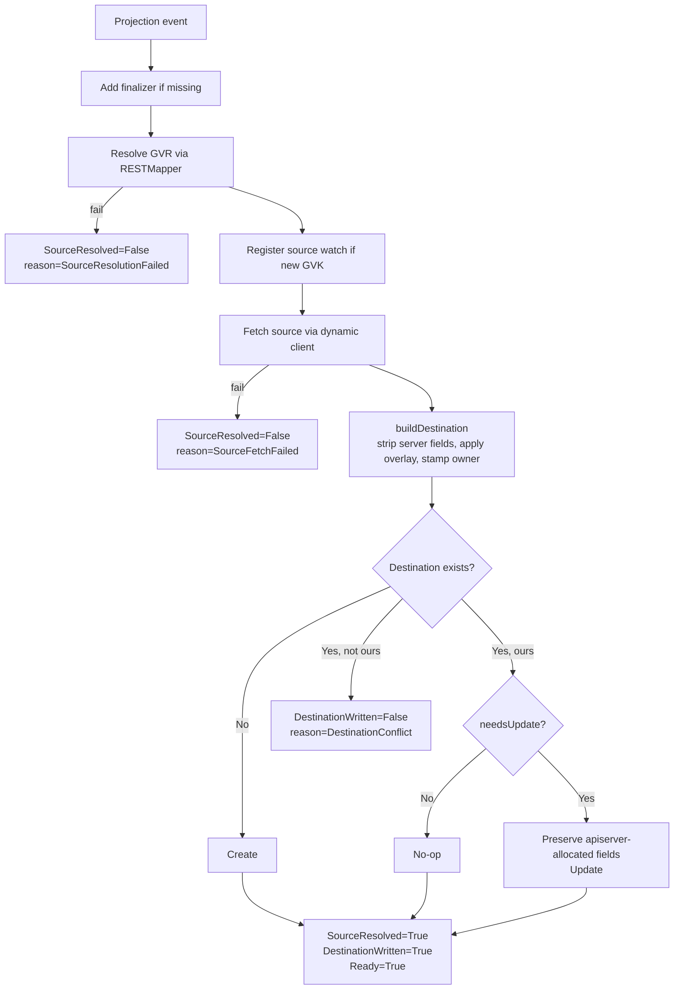

# Concepts

A `Projection` is a declarative instruction: *take this source object, produce a copy at this destination, keep it in sync*. This page explains the moving pieces.

## 1. Source

The source uniquely identifies the Kubernetes object to mirror:

```yaml
spec:
  source:
    apiVersion: v1          # required
    kind: ConfigMap         # required, PascalCase
    name: app-config        # required, DNS-1123
    namespace: platform     # required, DNS-1123
```

All four fields are required and pattern-validated at admission time — typos fail at `kubectl apply`, not at runtime. `apiVersion` + `kind` are resolved through the apiserver's `RESTMapper`, so anything the cluster knows about works: built-ins, aggregated APIs, CRDs.

## 2. Destination

The destination says where to write the copy. There are two shapes:

**Single destination** — one target namespace:

```yaml
spec:
  destination:
    namespace: tenant-a     # optional; defaults to Projection's own namespace
    name: shared-config     # optional; defaults to source.name
```

**Fan-out** — every namespace matching a label selector gets a copy:

```yaml
spec:
  destination:
    namespaceSelector:
      matchLabels:
        projection.be0x74a.io/mirror: "true"
    name: shared-config     # optional; same name used in every matching namespace
```

`namespace` and `namespaceSelector` are mutually exclusive — pick one. All fields are optional: the simplest `Projection` only needs a `source` block and mirrors into its own namespace under the source's name.

Fan-out behavior at a glance:

- Each matching namespace gets a destination, independently created/updated.
- If a namespace later stops matching (label removed), its destination is deleted.
- Creating a new namespace with the matching label triggers a reconcile and the destination appears.
- A conflict in one namespace (stranger object at the destination) doesn't block the others; `DestinationWritten` is a rollup condition with per-namespace detail surfaced via Events.
- On Projection deletion, all owned destinations are cleaned up across every namespace.

The destination `Kind` is always the same as the source `Kind` — `projection` does not transform Kinds.

## 3. Overlay

The overlay merges **labels** and **annotations** on top of the source's metadata before writing:

```yaml
spec:
  overlay:
    labels:
      tenant: tenant-a
      projected-by: projection
    annotations:
      mirror.example.com/source: platform/feature-flags
```

Merge rules:

- Source labels/annotations are preserved.
- Overlay entries **win on key conflict** (overlay-last semantics).
- `spec` / `data` are never modified by the overlay — it only touches metadata.

Regardless of what you put in overlay, the controller always stamps:

```yaml
annotations:
  projection.be0x74a.io/owned-by: <projection-namespace>/<projection-name>
```

This is how ownership detection works (next section).

## 4. Ownership

Every destination written by a `Projection` is stamped with the annotation `projection.be0x74a.io/owned-by`. On every reconcile, before touching an existing destination, the controller checks:

```
obj.metadata.annotations["projection.be0x74a.io/owned-by"] == "<projection-ns>/<projection-name>"
```

The three outcomes:

| Destination state                                  | Behavior                                                        |
| -------------------------------------------------- | --------------------------------------------------------------- |
| Does not exist                                     | Create it, stamp the ownership annotation.                      |
| Exists with matching ownership annotation          | Update it (only if `needsUpdate` says the content differs).     |
| Exists with a different or missing annotation      | Refuse; report `Ready=False reason=DestinationConflict`.        |

This is what prevents `projection` from silently clobbering an object somebody else created by mistake or on purpose.

## 5. Finalizer

When the Projection is first reconciled, the controller adds the finalizer `projection.be0x74a.io/finalizer`. On deletion:

1. The finalizer blocks final removal.
2. The controller looks up the destination.
3. If the destination still carries our ownership annotation, delete it.
4. If the annotation has been stripped or changed, **leave the destination alone** and emit a `DestinationLeftAlone` event.
5. Remove the finalizer.

Stripping the ownership annotation is therefore a deliberate escape hatch: "this mirror has become authoritative, don't touch it."

## 6. Reconcile lifecycle



Each step in plain prose:

1. **Resolve GVR.** Parse `spec.source.apiVersion`, combine with `spec.source.kind`, run it through the `RESTMapper`. If the cluster doesn't know the Kind, fail with `SourceResolutionFailed`.
2. **Register source watch.** On the first time we see a given GVK, register a metadata-only watch against the cache so future edits to *any* source of that Kind are fanned out to the referencing Projections via a field-indexed lookup.
3. **Fetch the source** via the dynamic client using the resolved GVR.
4. **Build the destination object.** Deep-copy the source, strip server-owned metadata (`resourceVersion`, `uid`, `managedFields`, `ownerReferences`, etc.), drop `.status`, remove `kubectl.kubernetes.io/last-applied-configuration`, strip Kind-specific apiserver-allocated spec fields (e.g. `Service.spec.clusterIP`), apply the overlay, stamp the ownership annotation, set destination namespace and name.
5. **Conflict check.** If an object already exists at the destination and isn't ours, fail with `DestinationConflict` — do not write.
6. **Create or update.** On update, preserve apiserver-allocated fields the apiserver re-assigned (so an `Update` isn't rejected for clearing an immutable field), and **diff** against the existing destination. If nothing changed, skip the write entirely (prevents noisy Events / metric churn on steady-state reconciles).
7. **Update status.** Flip `SourceResolved`, `DestinationWritten`, and `Ready` to `True` in a single status write. Increment `projection_reconcile_total{result="success"}`.

On any failure the corresponding condition flips to `False` (or `Unknown` for writes that never happened because the source side failed), a `Warning` event fires, and the metric increments with the right `result` label. The periodic `RequeueAfter` of 30 s on the error path is a safety net; the dynamic source watch is authoritative for the happy path.

## 7. Source projectability policy

Because the operator holds cluster-wide read RBAC, anyone authorized to create a `Projection` could, in principle, read any resource in the cluster via the controller. The source-projectability policy is the user-facing defense against that — source owners get to declare whether their object is eligible for projection.

**Controller-level mode** — a single cluster-admin-configured flag:

| Mode | Behavior |
|---|---|
| `allowlist` (default) | Source must carry `projection.be0x74a.io/projectable: "true"`. Missing or other values are treated as not projectable. |
| `permissive` | Any source is projectable *unless* it carries the veto annotation. |

Set via the CLI flag `--source-mode=permissive|allowlist` (or the Helm value `sourceMode`).

**Source-owner veto** — always honored regardless of mode:

```yaml
metadata:
  annotations:
    projection.be0x74a.io/projectable: "false"    # hard stop
```

When a previously-projected source flips to `"false"`, the destination is **garbage-collected on the next reconcile** — owners retract, not just block future copies.

**Status reasons** to recognize:

- `SourceResolved=False reason=SourceOptedOut` — source explicitly vetoed with `"false"`.
- `SourceResolved=False reason=SourceNotProjectable` — allowlist mode, no `"true"` annotation present.

**Honest limitation**: this is a *policy* control, not a true isolation boundary. The controller still has cluster-wide read RBAC, so a compromised operator pod (or a malicious `Projection` created by a privileged user who can bypass admission policy) is not constrained by the annotation. True end-to-end enforcement would require dynamically narrowing the controller's RBAC per declared source Kind — a future direction, not v0.1.

## 8. Watches

- No source watch is declared at startup. The controller starts with only a watch on `Projection` itself.
- The first reconcile for a given source GVK registers a dynamic, **metadata-only** source watch (we don't need the full object — events just enqueue Projections, the next reconcile fetches fresh).
- A field indexer on `spec.sourceKey` (derived from `apiVersion/kind/namespace/name`) maps incoming source events to every Projection pointing at them in a single cached `List` call — O(1) regardless of how many Projections reference the same source.
- Subsequent Projections that reference the same GVK reuse the existing watch.

This is what keeps propagation under ~100 ms without periodic polling.

## Related

- [CRD reference](crd-reference.md) — exact field types and validation.
- [Observability](observability.md) — conditions, events, metrics.
- [Security](security.md) — the RBAC trade-offs behind "any Kind".
